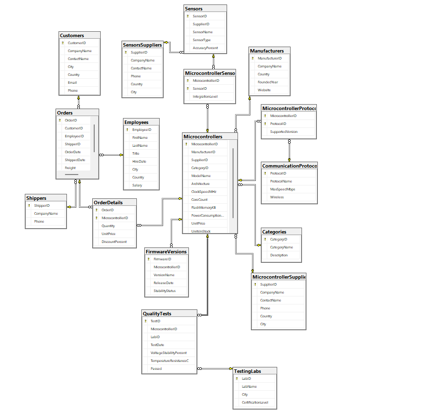
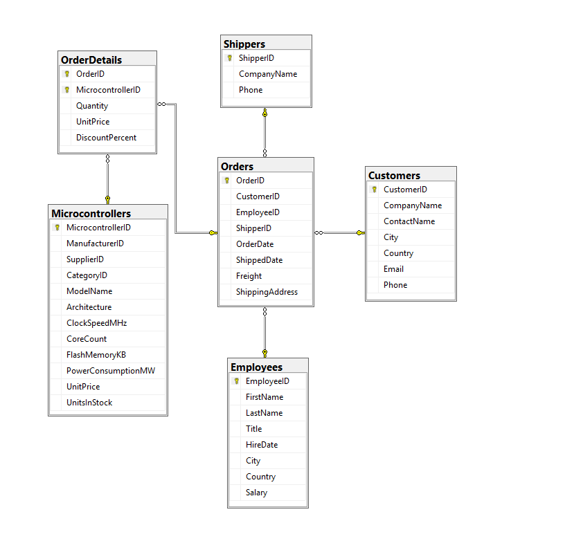
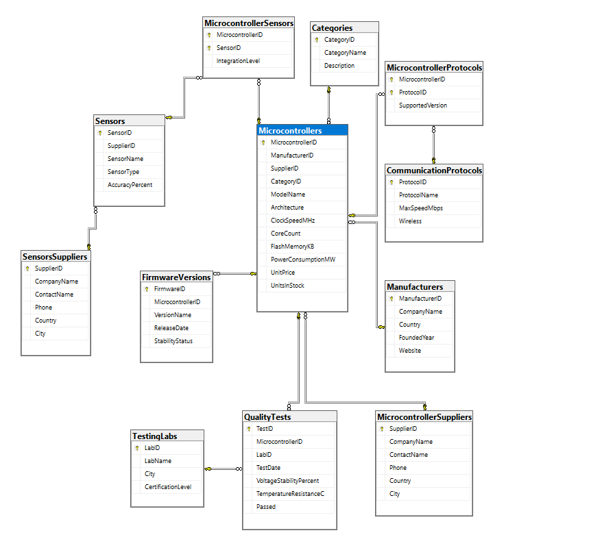
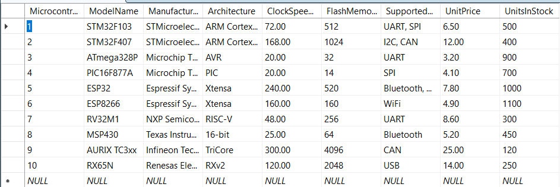
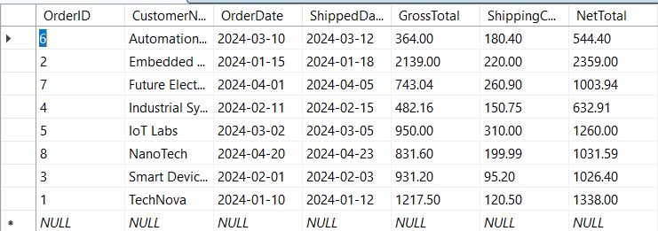
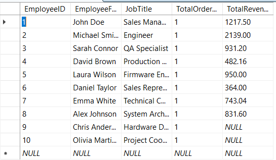
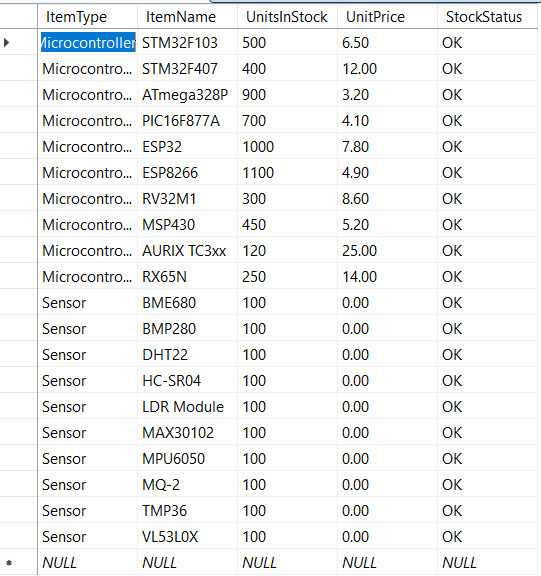
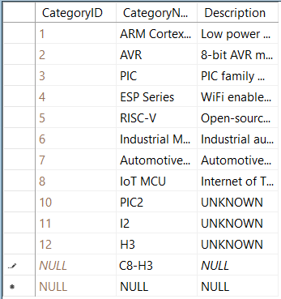
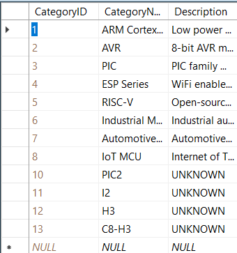

# MicrocontrollerFirm — Relational Database (MySQL)

A relational database modeling the operations of a fictional microcontroller
distributor: manufacturers, suppliers, product catalog (microcontrollers,
sensors, firmware, communication protocols), quality testing, and the
sales pipeline (customers, employees, orders, shipping).

## Highlights

- **17 tables**, normalized to **3NF**
- **3 many-to-many relationships** resolved through junction tables:
  `MicrocontrollerSensors` (microcontrollers ↔ sensors),
  `MicrocontrollerProtocols` (microcontrollers ↔ communication protocols),
  and `OrderDetails` (orders ↔ microcontrollers)
- Primary keys, foreign keys, `UNIQUE` constraints, and `CHECK` constraints
  enforcing real business rules (price ranges, valid phone formats, valid
  architecture names, salary bands, date sanity, etc.)
- A `BEFORE INSERT` trigger and 4 views, including one using
  `GROUP_CONCAT` to flatten a many-to-many relationship into a single
  readable column
- Every script, constraint, the trigger, and all views were run and
  verified against a live MySQL/MariaDB instance before being published
  here

## Entity-Relationship Diagrams

**Full schema** — all 17 tables and how they connect:



**Sales process** — customers, employees, shippers, orders and order lines:



**Manufacturing / product catalog process** — microcontrollers, sensors,
protocols, firmware, and quality testing:



## Schema overview

| Group | Tables |
|---|---|
| Catalog / reference data | `Categories`, `Manufacturers`, `MicrocontrollerSuppliers`, `SensorsSuppliers`, `CommunicationProtocols`, `TestingLabs` |
| Product data | `Microcontrollers`, `Sensors`, `MicrocontrollerSensors` (N:M), `MicrocontrollerProtocols` (N:M), `FirmwareVersions`, `QualityTests` |
| Sales pipeline | `Customers`, `Employees`, `Shippers`, `Orders`, `OrderDetails` |

## Data integrity by design

The schema is intentionally strict: validation lives in the database
itself, not only in application code. Every table carries primary keys,
foreign keys, and a matching set of `UNIQUE`/`CHECK` constraints (see the
full list in [`03_constraints.sql`](03_constraints.sql)), for example:

- `Microcontrollers.Architecture` is restricted via `CHECK` to a fixed list
  of real architectures (`ARM Cortex-M`, `AVR`, `PIC`, `RISC-V`, `Xtensa`,
  `16-bit`, `RXv2`, `TriCore`)
- Phone numbers on suppliers, customers and shippers are validated with a
  `REGEXP` pattern matching two accepted formats (`XXX-XXX-XXXX` /
  `XXXX-XXX-XXX`)
- `Employees.Salary` must fall between 2000 and 10000; `Orders.Freight`
  must be positive and under 50000
- `Orders.OrderDate <= Orders.ShippedDate` is enforced at the database
  level, not just in application code

This is a deliberate defense-in-depth choice: any application built on top
of this database gets an extra layer of protection against bad data, since
invalid rows are rejected by the schema itself even if a bug, a different
client, or a direct SQL connection bypasses the application's own
validation logic.

One trade-off worth knowing: a few date-based rules (e.g. "not in the
future") are enforced at the application layer rather than as `CHECK`
constraints, since SQL `CHECK` expressions must be deterministic and can't
reference functions like `CURDATE()`/`NOW()`. Everything else — ranges,
formats, and enumerations — is enforced directly in the schema.

## Setup

Requires **MySQL 8.0.16+** or **MariaDB 10.2.1+** (earlier versions parse
`CHECK` constraints but silently ignore them).

```bash
mysql -u root -p < 01_create_database.sql
mysql -u root -p < 02_create_tables.sql
mysql -u root -p < 03_constraints.sql
mysql -u root -p < 04_inserts.sql
mysql -u root -p < 05_triggers.sql
mysql -u root -p < 06_views.sql
```

Then explore with:

```bash
mysql -u root -p MicrocontrollerFirm < 07_queries.sql
```

## Views

### `v_MicrocontrollerTechnicalCatalog`
Joins each microcontroller to its manufacturer and uses a correlated
subquery with `GROUP_CONCAT` to list every communication protocol it
supports as a single comma-separated column — a clean way to flatten a
many-to-many relationship for reporting.



### `v_OrderFinancialSummary`
Computes, per order, the discounted gross total, the shipping cost, and
the net total actually billed to the customer.



### `v_EmployeeSalesPerformance`
Aggregates orders and revenue per employee. Employees whose assigned order
has no line items yet (e.g. `Chris Anderson`, `Olivia Martinez` below)
correctly show `NULL` revenue rather than `0`, reflecting that no sale
value has actually been recorded — standard `SUM()`-over-no-rows behavior.



### `v_InventoryStatusAlerts`
A unified stock-alert view across product types (`OUT OF STOCK` /
`LOW STOCK ALERT` / `OK`). Sensors are included via `UNION ALL` with
placeholder stock/price values, since the `Sensors` table doesn't track
inventory in this schema — a natural next step would be adding
`UnitsInStock`/`UnitPrice` columns to `Sensors` directly.



## Trigger: `trg_DefaultCategoryDescription`

A `BEFORE INSERT` trigger on `Categories` that fills in `'UNKNOWN'` for any
new category inserted without a description, without touching existing
rows. Demonstrated below: category `C8-H3` is inserted with a `NULL`
description, and after a refresh the trigger has filled it in.

**Before refresh** (row just inserted, `NULL` description):



**After refresh** (description auto-filled to `UNKNOWN`):



## Example queries

[`07_queries.sql`](07_queries.sql) contains 7 analytical queries, including:

1. Manufacturer-level rollup (model count, avg core count, avg power draw, etc.)
2. Microcontrollers with below-average voltage stability, joined to their test lab
3. Every sensor integrated per model, with its supplier
4. Wireless protocol adoption across the product line
5. Firmware versions with age in days since release
6. Revenue generated per model (quantity, avg sale price, discounted total)
7. Inventory status per category, with a `CASE`-based restocking flag

## Tech stack

MySQL 8.0+ / MariaDB 10.2.1+ · pure SQL (DDL, DML, views, triggers)
